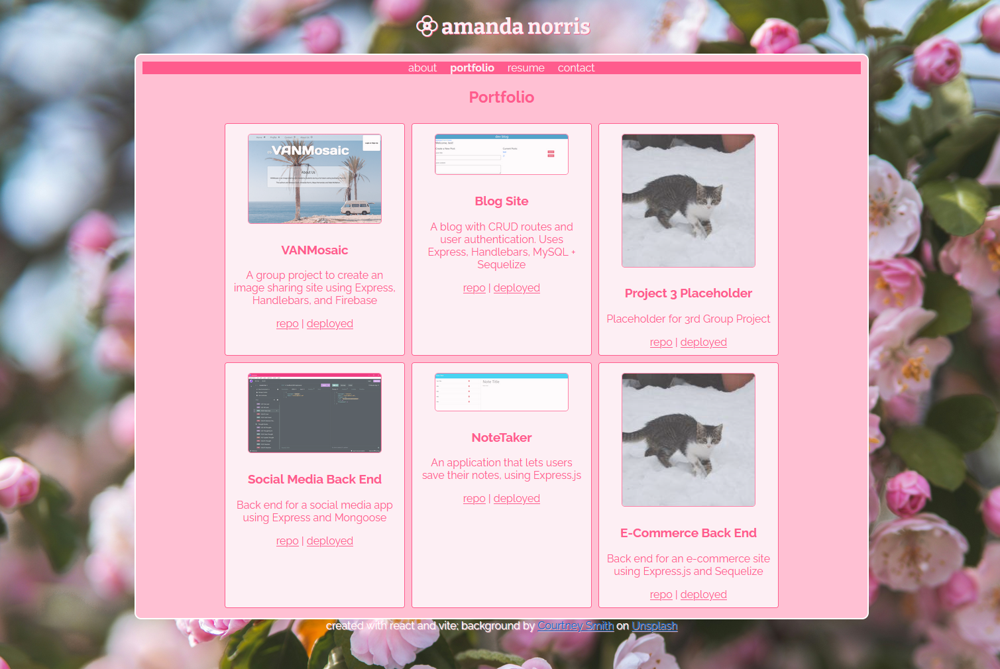

# <React-Portfolio>

## Description

For this project, I created a developer portfolio using React and Vite. I used react-router to navigate the site and react-transition-group to animate page changes. Each page has their own component, as well as a Header, Footer, and Navbar that remain the same throughout. 

## Installation

N/A

## Usage

You may view the deployed project [here](https://aknportfolio.netlify.app/).

## Credits

- Class material from the KU Full Stack Web Development Bootcamp
- [React Transition Group with React Router Tutorial](https://reactcommunity.org/react-transition-group/with-react-router)

## License

Please see license on GitHub Repo